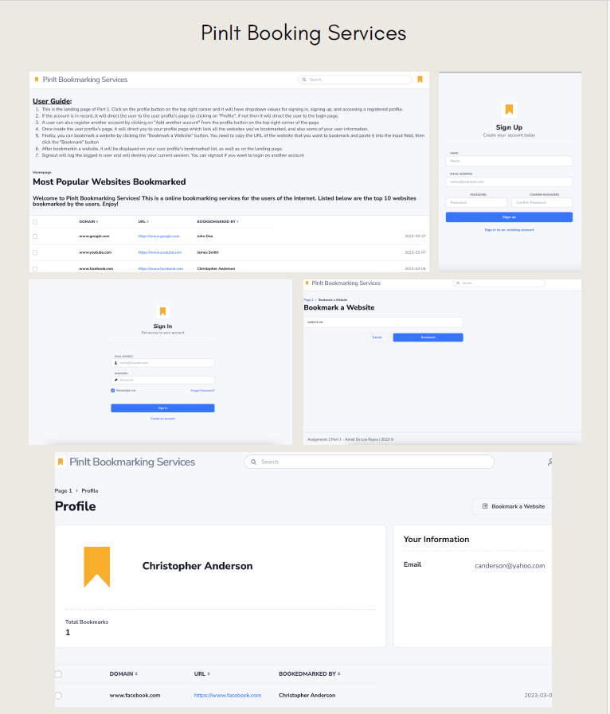

# PinIt Booking Services

Welcome to PinIt Booking Services, a cutting-edge booking platform developed using Python Django for a university project.

## Tech Stack

### Python Django

Django, a high-level web framework in Python, empowers PinIt with rapid development, scalability, and a clean, pragmatic design.

### MySQL

MySQL serves as the robust relational database management system, ensuring efficient data storage, retrieval, and management for PinIt's booking services.

### HTML5/CSS

Utilizing HTML5 and CSS provides a modern, responsive user interface, ensuring a seamless and visually appealing booking experience for users.

### Bootstrap

Bootstrap enhances PinIt's overall design and user experience, providing a responsive and mobile-friendly platform.

## Key Features

- **Effortless Booking:** PinIt simplifies the booking process, making it easy for users to reserve services seamlessly.

- **User-Friendly Interface:** The intuitive interface ensures a pleasant user experience, encouraging users to explore and utilize PinIt effortlessly.

- **Secure Data Management:** With MySQL, PinIt ensures the secure and efficient management of user data, maintaining the integrity and confidentiality of information.

- **Responsive Design:** The use of Bootstrap ensures PinIt adapts to various devices, offering a consistent and visually appealing experience on desktops, tablets, and smartphones.

Feel free to explore the codebase and contribute to the continuous improvement of PinIt Booking Services. Together, we are creating innovative solutions in the realm of booking platforms!

# Project Images:

